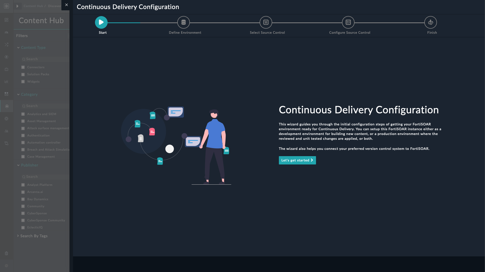
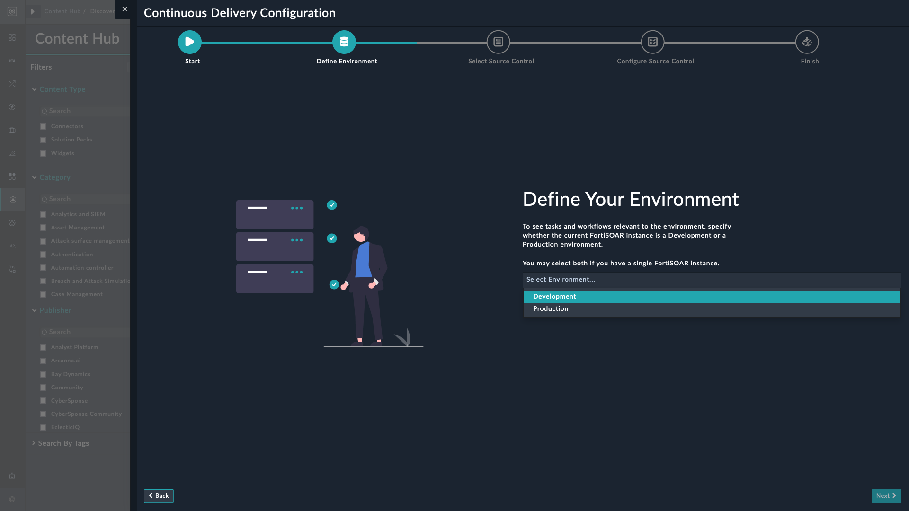
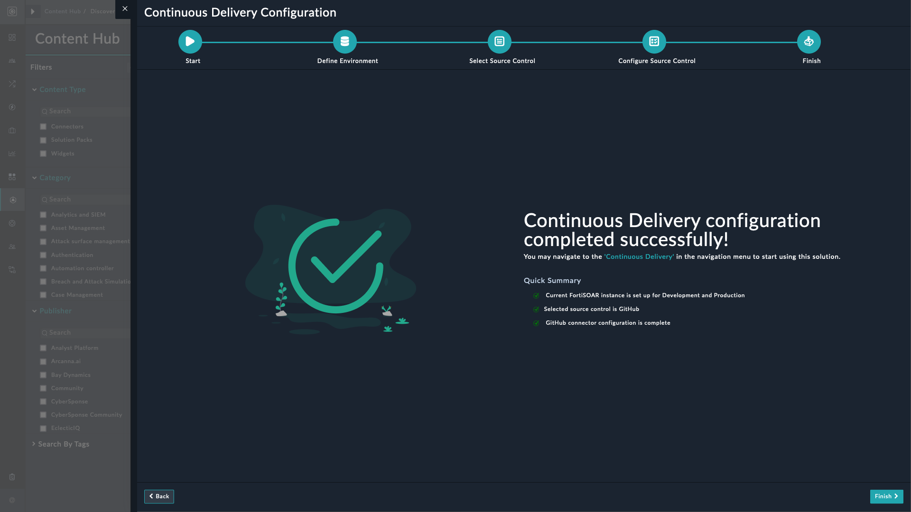

| [Home](../README.md) |
|--------------------------------------------|

# Installation

1. To install a widget, click **Content Hub** > **Discover**.

2. From the list of solution pack that appears, search for and select **Continuous Delivery**. 

3. Click the card of the **Continuous Delivery** solution pack card.

4. Click **Configure** on the bottom to begin configuration.

# Configuration

## CICD Configuration Wizard Widget Settings

The configuration settings of the CICD Configuration widget include the following steps to setup CICD configuration:

- Click the **Configure** button to bring up the following wizard screen

    

- Click **Let's Get Started** to proceed

- On **Define Environment** page, select the FortiSOAR environment type &mdash; **Development** and **Production**.

- Click **Next** on lower-right corner

    

- On the **Connect Version Control** page, configure your GitHub version control environment.

- Click **Next** on lower-right corner

    > **Note:** For now, only version control using GitHub is supported

    

- Click **Finish** to complete the configuration.

    

Navigate to the **Continuous Delivery** in the navigation menu to start using the solution pack